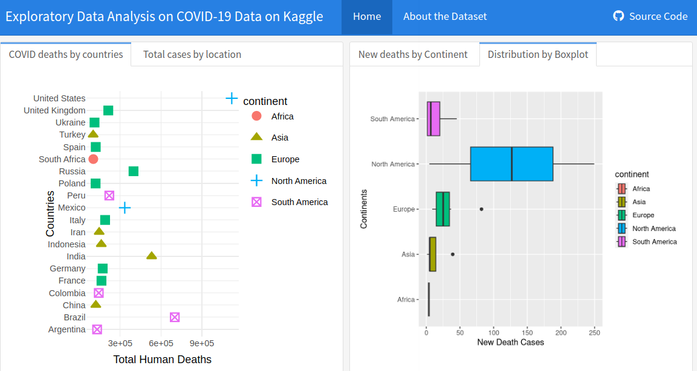

# covid-19-explore

In this project, I have created interactive visualizations on Flex Dashboard and I've used the COVID-19 Deaths dataset from Kaggle.

<https://www.kaggle.com/datasets/tohidkhanbagani/covid-19-deaths-and-vaccinations-dataset>

About COVID-19 Deaths and Vaccinations

This dataset contains two files that provide detailed information on Covid-19 deaths and vaccinations worldwide. The first file contains data on the number of Covid-19 deaths, including total deaths and new deaths, across different locations and time periods.

The second file contains data on Covid-19 vaccinations, including total vaccinations, people vaccinated, people fully vaccinated, and total boosters, across different locations and time periods. By analyzing this data, you can uncover insights into the global impact of Covid-19 and explore the relationship between vaccinations and deaths.

This dataset is a valuable resource for researchers, data analysts, and anyone interested in understanding the ongoing pandemic.



COVID DEATHS Columns

```         
iso_code: The ISO 3166-1 alpha-3 code of the country or territory.
continent: The continent of the location.
location: The name of the country or territory.
date: The date of the observation.
population: The population of the country or territory.
total_cases: The total number of confirmed cases of Covid-19.
new_cases: The number of new confirmed cases of Covid-19.
new_cases_smoothed: The 7-day smoothed average of new confirmed cases of Covid-19.
total_deaths: The total number of deaths due to Covid-19.
new_deaths: The number of new deaths due to Covid-19.
new_deaths_smoothed: The 7-day smoothed average of new deaths due to Covid-19.
total_cases_per_million: The total number of confirmed cases of Covid-19 per million people.
new_cases_per_million: The number of new confirmed cases of Covid-19 per million people.
new_cases_smoothed_per_million: The 7-day smoothed average of new confirmed cases of Covid-19 per million people.
total_deaths_per_million: The total number of deaths due to Covid-19 per million people.
new_deaths_per_million: The number of new deaths due to Covid-19 per million people.
new_deaths_smoothed_per_million: The 7-day smoothed average of new deaths due to Covid-19 per million people.
reproduction_rate: The estimated average number of people each infected person infects (the "R" number).
icu_patients: The number of patients in intensive care units (ICU) with Covid-19 on the given date.
icu_patients_per_million: The number of patients in intensive care units (ICU) with Covid-19 on the given date, per million people.
hosp_patients: The number of patients in hospital with Covid-19 on the given date.
hosp_patients_per_million: The number of patients in hospital with Covid-19 on the given date, per million people.
weekly_icu_admissions: The weekly number of patients admitted to intensive care units (ICU) with Covid-19.
weekly_icu_admissions_per_million: The weekly number of patients admitted to intensive care units (ICU) with Covid-19, per million people.
weekly_hosp_admissions: The weekly number of patients admitted to hospital with Covid-19.
weekly_hosp_admissions_per_million: The weekly number of patients admitted to hospital with Covid-19, per million people.
```

Hosted at;

<https://silasbea.shinyapps.io/covid-19-explore/>

Enjoy!

Silas Bamidele
